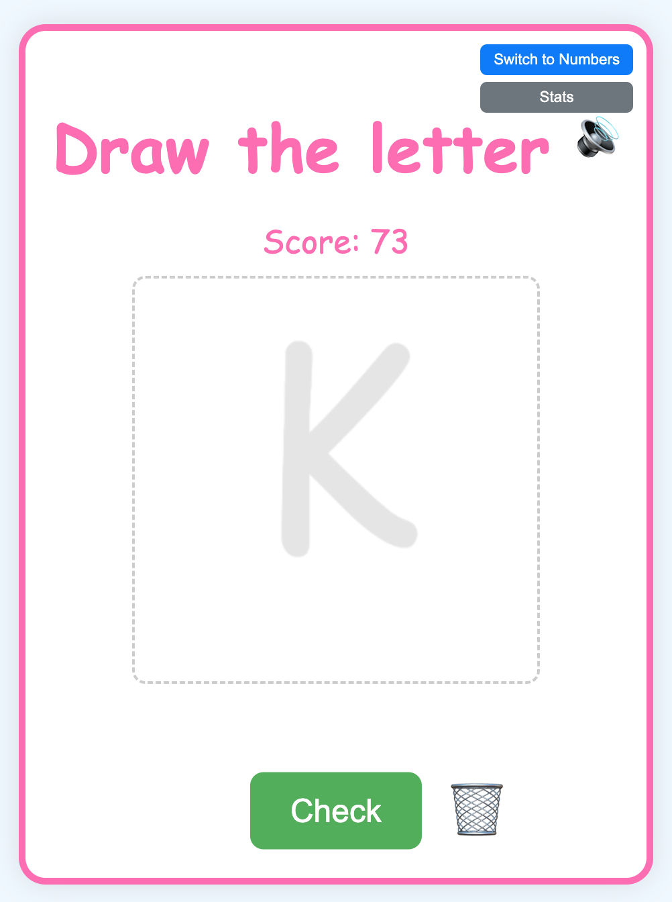

# Learn Numbers and Letters Game

A fun and interactive game for kids to learn how to write numbers and letters. The game uses your browser's speech synthesis to announce a character, and you draw it on the canvas. An OCR (Optical Character Recognition) engine then checks your drawing.

**Play the game here: [shelajev.github.io/numbers](https://shelajev.github.io/numbers)**

## Features

- **Intelligent OCR Checking**: Uses Tesseract.js to recognize the characters you draw.
- **Dual Modes**: Switch between learning numbers and capital letters.
- **Voice Prompts**: The game speaks the character you need to draw, with a friendly female voice.
- **Replay Sound**: A button to replay the voice prompt if you miss it.
- **Adaptive Hints**: A transparent guide of the character is shown to help you. This guide disappears after you've successfully drawn a character four times.
- **Helpful Re-Hinting**: If you get stuck on a character you've already mastered, the hint will reappear after two incorrect attempts.
- **Progressive Difficulty**: In number mode, after 4 correct answers, the game introduces numbers up to 20.
- **Score Tracking**: Keeps track of your total score.
- **Persistent Stats**: Your scores for each character are saved in your browser's `localStorage`, so you can pick up where you left off.
- **Distraction-Free Drawing**: The canvas is locked while the game is checking your answer.
- **Fun Colors**: The drawing brush color changes to a bright, happy color with every new level.

## Privacy

Your privacy is important. All the character recognition (OCR) happens directly on your device within your browser. Your drawings are never sent to a server.

## How to Play

1.  Click the "Start Game" button.
2.  Listen to the voice prompt to know which character to draw.
3.  Use the "Switch to Letters/Numbers" button to change modes.
4.  Use your mouse or finger (on touch devices) to draw the character on the canvas.
5.  Click the "Check" button to have your drawing recognized.
6.  If you're correct, you'll get a point and a new character.
7.  If you're incorrect, you can try again.
8.  Click the speaker icon (🔊) at any time to hear the prompt again.
9.  Click the "Stats" button to see your progress for each character.